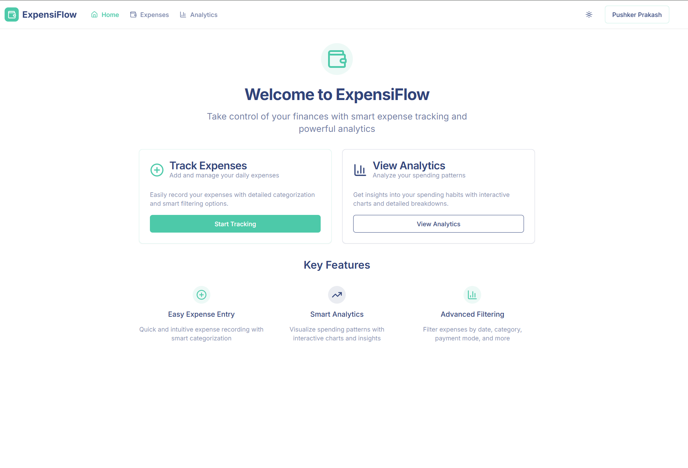
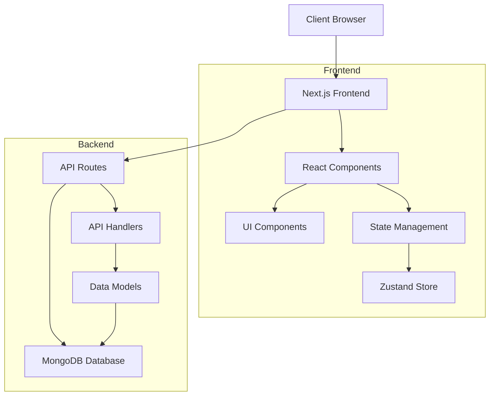

# Expensify - Modern Expense Tracking Application

A full-stack expense tracking application built with Next.js, TypeScript, and MongoDB. Track your expenses, analyze spending patterns, and manage your finances effectively.



## 🏗️ Architecture



## 🚀 Features

- 💰 Track daily expenses with detailed categorization
- 📊 Interactive analytics and spending insights
- 📅 Date-based filtering and custom date ranges
- 🔍 Advanced search and filtering capabilities
- 💳 Multiple payment mode tracking
- 📱 Responsive design for all devices
- 🌓 Dark/Light mode support
- 🔐 User authentication and data privacy

## 🛠️ Tech Stack

### Frontend
- **Framework**: Next.js 13+ with App Router
- **Language**: TypeScript
- **State Management**: Zustand
- **UI Components**: 
  - Shadcn/ui
  - Tailwind CSS
  - Radix UI Primitives
- **Charts**: Recharts
- **Form Handling**: React Hook Form with Zod validation
- **Date Handling**: date-fns

### Backend
- **Runtime**: Node.js
- **Database**: MongoDB with Mongoose
- **API**: Next.js API Routes
- **Authentication**: NextAuth.js

## 📋 Prerequisites

- Node.js 18+ 
- MongoDB instance
- npm or yarn package manager

## 🚀 Getting Started

1. **Clone the repository**
   ```bash
   git clone https://github.com/yourusername/expensify.git
   cd expensify
   ```

2. **Install dependencies**
   ```bash
   npm install
   # or
   yarn install
   ```

3. **Set up environment variables**
   Create a `.env.local` file in the root directory:
   ```env
   MONGODB_URI=your_mongodb_connection_string
   NEXTAUTH_SECRET=your_nextauth_secret
   NEXTAUTH_URL=http://localhost:3000
   ```

4. **Run the development server**
   ```bash
   npm run dev
   # or
   yarn dev
   ```

5. **Open [http://localhost:3000](http://localhost:3000) in your browser**

## 📁 Project Structure

```
expensify/
├── app/                    # Next.js app directory
│   ├── api/               # API routes
│   ├── (auth)/           # Authentication routes
│   ├── expenses/         # Expense management routes
│   └── analytics/        # Analytics routes
├── components/            # React components
│   ├── ui/              # Reusable UI components
│   └── features/        # Feature-specific components
├── lib/                  # Utility functions
├── store/               # Zustand store
├── public/              # Static assets
└── types/               # TypeScript type definitions
```

## 🔧 Configuration

### MongoDB Setup
1. Create a MongoDB Atlas account or use a local MongoDB instance
2. Create a new database
3. Get your connection string
4. Add it to your `.env.local` file

### Authentication
The application uses NextAuth.js for authentication. Configure your authentication providers in the `app/api/auth/[...nextauth]/route.ts` file.

## 🧪 Testing

```bash
# Run tests
npm run test

# Run linting
npm run lint
```

## 📦 Deployment

1. **Build the application**
   ```bash
   npm run build
   ```

2. **Start the production server**
   ```bash
   npm start
   ```

## 🤝 Contributing

1. Fork the repository
2. Create your feature branch (`git checkout -b feature/AmazingFeature`)
3. Commit your changes (`git commit -m 'Add some AmazingFeature'`)
4. Push to the branch (`git push origin feature/AmazingFeature`)
5. Open a Pull Request

## 📝 License

This project is licensed under the MIT License - see the [LICENSE](LICENSE) file for details.

## 👥 Authors

- Pushker Prakash - Initial work - [YourGitHub](https://github.com/rangercoder)

## 🙏 Acknowledgments

- [Next.js](https://nextjs.org/)
- [Shadcn/ui](https://ui.shadcn.com/)
- [MongoDB](https://www.mongodb.com/)
- [Zustand](https://github.com/pmndrs/zustand)
- [Recharts](https://recharts.org/) 